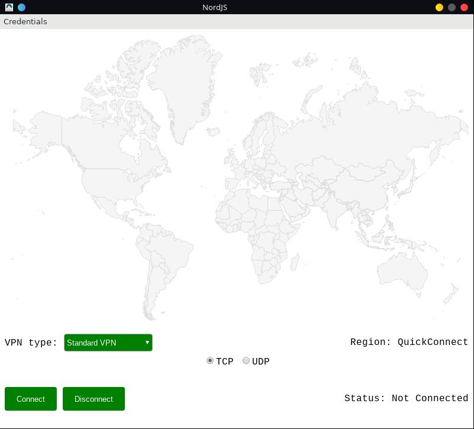
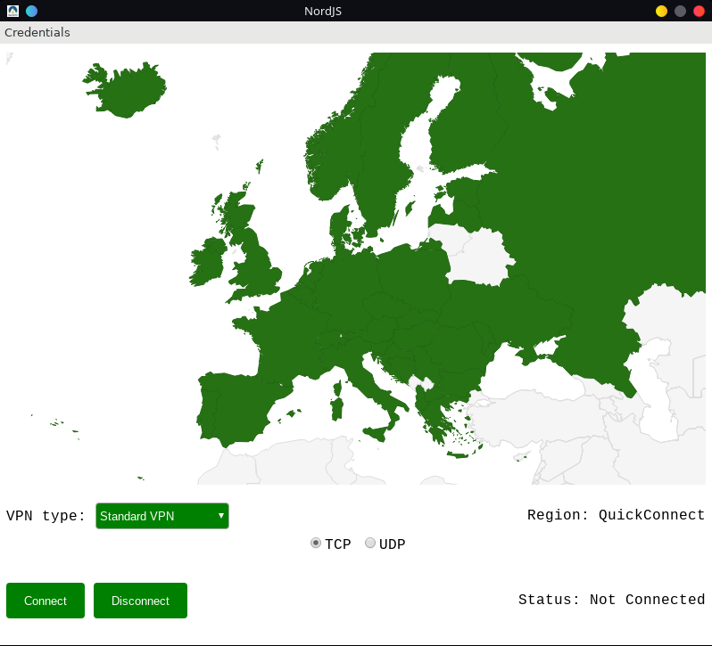

# Simple Gui to use NordVPN on Linux

---
if you want more options check this [repo](https://github.com/morpheusthewhite/NordPy)
---

---

<p align="center">
  |


## Installation

You can try to execute 
```bash 
sudo ./install.sh
```

---

#### NPM 
```bash
curl -sL https://deb.nodesource.com/setup_8.x | sudo -E bash -
sudo apt-get install nodejs
```

#### Electron
```bash
sudo npm install electron -g
```

#### Sudo Prompt
```bash 
sudo npm install sudo-prompt
```

#### sudo Shelljs
```bash
sudo npm install shelljs --save
```

#### Child Process Promise
```bash
npm install child-process-promise --save
```

#### OpenVPN

[NordVPN instructions](https://nordvpn.com/it/tutorials/linux/openvpn/)

---

## Start

```bash
node start.js
```

